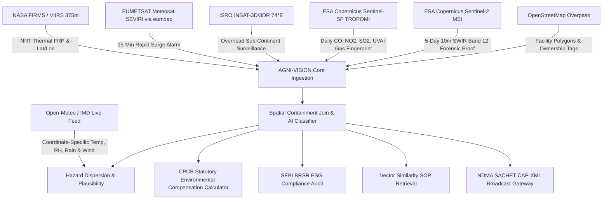

# AGNI-VISION: Technical Specification & System Architecture
## Geospatial Thermal Intelligence & Automated Incident Response Platform

---

## 1. Executive Summary & Problem Context

In industrial clusters, chemical refineries, thermal power stations, and petrochemical complexes across India, continuous flaring and unmonitored thermal surges represent severe environmental, statutory, and safety hazards. Standard ground sensors (CEMS) are prone to tampering, local power failures, or deliberate shutdowns during unscheduled hydrocarbon purges. 

**AGNI-VISION** is an AI-enabled space-to-ground geospatial intelligence system. It merges:
- **Low Earth Orbit (LEO) Satellite Radiance** (NASA FIRMS VIIRS 375m, VIIRS Nightfire / VNF, Sentinel-2/3)
- **Spatial Infrastructure Footprints** (OpenStreetMap industrial boundaries)
- **Historical Baseline Modeling** (30-day and 90-day persistence envelopes)
- **Atmospheric Dispersion Physics** (Downwind Gaussian-type plume kinematics)
- **National Regulatory Frameworks** (CPCB NGT Environmental Compensation Formula & SEBI BRSR Principle 6)
- **Emergency Dispatch Protocols** (NDMA SACHET OASIS CAP-v1.2 XML)

---

## 2. Technical Documentation Index

For deep-dive architectural specifications, refer to the dedicated modular guides:
- 🛰️ **[Satellite Telemetry & Remote Sensing Guide](docs/SATELLITE_REMOTE_SENSING.md)**: Physical fundamentals, band formulas, Sentinel-5P gas spectrometry ($CO$, $NO_2$, $SO_2$, UVAI), and Sentinel-2 $\Delta\text{NBR}$ burn scar indices.
- ⚡ **[Geostationary SEVIRI & INSAT Guide](docs/GEOSTATIONARY_SEVIRI_INSAT.md)**: 15-minute rapid scan mechanics, `eumdac` Python SDK microservice, and zero-slant nadir observation.
- 🔍 **[Cadence, Frequency & Live Verification Guide](docs/CADENCE_AND_VERIFICATION_GUIDE.md)**: How often data arrives (15m vs 24h vs 5-day), orbital pass times, and step-by-step instructions to verify live NASA/Copernicus streams.

---

## 3. Comprehensive Multi-Constellation Architecture



### 3.1. NASA FIRMS (Fire Information for Resource Management System)
- **Endpoint**: `https://firms.modaps.eosdis.nasa.gov/api/area/csv/{MAP_KEY}/{SOURCE}/{BBOX}/{DAYS}`
- **Source Sensors**: VIIRS S-NPP (VNP14IMGTDL_NRT) & NOAA-20/21 (VJ114IMGTDL_NRT) at 375-meter spatial resolution.
- **Key Parameters**:
  - `frp` (Fire Radiative Power in Megawatts, MW): Measures total radiant energy output.
  - `brightness` (Channel I-4 Brightness Temperature in Kelvin): Mid-infrared (3.74 µm) thermal response.
  - `confidence`: NASA algorithmic reliability percentage.
- **Purpose**: Detects raw thermal hotspots across India within 3 hours of orbital overpass.

### 3.2. VIIRS Nightfire (VNF / Earth Observation Group)
- **Physics Foundation**: Dual-band Planck blackbody radiation curve fitting using SWIR (1.6 µm) and NIR channels.
- **Key Outputs**:
  - Combustion Source Temperature ($T_e$ in Kelvin):
    - **Industrial Flaring**: $1,400\text{ K} - 1,850\text{ K}$
    - **Brick Kilns & Furnaces**: $1,050\text{ K} - 1,300\text{ K}$
    - **Forest Wildfires**: $750\text{ K} - 950\text{ K}$
    - **Agricultural Stubble**: $600\text{ K} - 800\text{ K}$
- **Purpose**: Prevents false alarms by discriminating between high-temperature gas flaring and low-temperature agricultural burning.

### 3.3. OpenStreetMap Overpass API
- **Endpoint**: `https://overpass-api.de/api/interpreter`
- **Query Type**: Overpass QL bounding box spatial extraction.
- **Tags Queried**:
  ```text
  [out:json];
  (
    node["industrial"~"oil_refinery|chemical|gas_processing"](bbox);
    way["landuse"="industrial"](bbox);
    relation["man_made"="flare_stack"](bbox);
  );
  out body; >; out skel qt;
  ```
- **Purpose**: Provides ground-truth facility boundaries to perform spatial containment joins.

### 3.4. ESA Copernicus Data Space / Sentinel-2 Multi-Spectral
- **Resolution**: 10-meter optical / 20-meter short-wave infrared (SWIR).
- **Band Formulation**:
  - **True Color RGB**: Band 4 (Red, 665 nm), Band 3 (Green, 560 nm), Band 2 (Blue, 490 nm).
  - **SWIR False Color**: Band 12 (SWIR-2, 2190 nm), Band 8A (Narrow NIR, 865 nm), Band 4 (Red).
- **Purpose**: Penetrates thick smoke plumes to confirm whether the thermal radiance originates from a licensed flare stack tip or an uncontrolled ground fire.

### 3.5. EUMETSAT Meteosat MSG-IODC SEVIRI (Geostationary Rapid Sensor via `eumdac` Python SDK)
- **Platform**: Meteosat-9 / Meteosat-11 (Indian Ocean Data Coverage - IODC positioned at $45.5^\circ\text{E}$ longitude).
- **Sensor**: Spinning Enhanced Visible and InfraRed Imager (SEVIRI).
- **Official Python Client**: `eumdac` (EUMETSAT Data Access Client v3.1.1+).
- **API Endpoint**: EUMETSAT Data Store (`https://api.eumetsat.int/data/search-products/1.0.0/os` & `https://api.eumetsat.int/token`).
- **Core Collections**:
  - `EO:EUM:DAT:MSG:HRSEVIRI-IODC`: High Rate SEVIRI Level 1.5 Image Data - MSG - Indian Ocean ($45.5^\circ\text{E}$).
  - `EO:EUM:DAT:MSG:HRSEVIRI`: High Rate SEVIRI Level 1.5 Image Data - MSG ($0^\circ$).
  - `EO:EUM:DAT:0801`: Active Fire Monitoring (CAP) - MTG ($0^\circ$).
- **Core Spectral Channels**: Channel 4 (MIR $3.92\ \mu\text{m}$) and Channel 9 (TIR $10.8\ \mu\text{m}$).
- **Temporal Cadence**: **15-minute continuous scan cycle** (96 full-disk passes per 24 hours).
- **Spatial Resolution**: $3.0\text{ km}$ at sub-satellite point (nadir), degrading to $\approx 4.8\text{ km} - 6.5\text{ km}$ over the Indian subcontinent due to high viewing zenith angles ($\theta_v \approx 50^\circ - 68^\circ$).
- **Architectural Role**: Serves as the rapid-alert tier in AGNI-VISION's multi-sensor constellation. Detects large blowout flares and explosion surges within 15 minutes of occurrence, triggering early warning dispatches before polar-orbiting VIIRS passes over.
- **Python Integration**:
  ```python
  import eumdac

  # Authenticate with credentials from https://api.eumetsat.int/api-key
  token = eumdac.AccessToken((consumer_key, consumer_secret))
  datastore = eumdac.DataStore(token)
  collection = datastore.get_collection('EO:EUM:DAT:MSG:HRSEVIRI-IODC')

  # Search 15-minute rapid scans over India
  products = collection.search(
      dtstart=start_time,
      dtend=end_time,
      geo='POLYGON((68.0 6.5, 97.5 6.5, 97.5 37.0, 68.0 37.0, 68.0 6.5))'
  )
  for prod in products:
      print(f"SEVIRI IODC 15m Pass: {prod} | Sensing: {prod.sensing_start}")
  ```
- **CLI Commands**:
  - Check status: `./venv/bin/python backend/seviri_eumdac.py status`
  - Search past 3 hours: `./venv/bin/python backend/seviri_eumdac.py search --hours 3`
  - Sync metadata to dashboard: `./venv/bin/python backend/seviri_eumdac.py sync`
  - Start local microservice: `./venv/bin/python backend/seviri_eumdac.py serve --port 5174`

### 3.6. ISRO INSAT-3D & INSAT-3DR Imager (Indian Geostationary Overhead Constellation)
- **Platforms**: INSAT-3D (positioned at $82^\circ\text{E}$) and INSAT-3DR (positioned at $74^\circ\text{E}$ directly over India).
- **Agency**: Indian Space Research Organisation (ISRO) via MOSDAC & Bhuvan.
- **Sensor**: 6-Channel Multi-Spectral Imager.
- **Core Thermal Channels**: Mid-Infrared (MIR $3.80 - 4.00\ \mu\text{m}$) and Thermal Infrared (TIR-1 $10.2 - 11.2\ \mu\text{m}$).
- **Temporal Cadence**: 30-minute full scan per satellite, interleaved to yield a **continuous 15-minute observation cycle**.
- **Spatial Resolution**: $4.0\text{ km}$ directly at nadir over India.
- **Key Advantage over SEVIRI**: Because INSAT is stationed directly above Central/Western India ($74^\circ - 82^\circ\text{E}$), it has **near-zero optical distortion and zero parallax displacement**, whereas Meteosat SEVIRI ($45.5^\circ\text{E}$) views India from a steep $55^\circ - 68^\circ$ oblique angle.

### 3.7. Multi-Satellite Orbital Interleaving Schedule (Eliminating the 12-Hour Gap)
To bridge the 12-hour blind spot between successive passes of a single polar satellite (e.g. VIIRS NOAA-20), AGNI-VISION interleaves an international and domestic constellation:

| Time Window (IST) | Satellite Platform | Sensor & Orbit | Spatial Resolution | Operational Role |
| :--- | :--- | :--- | :--- | :--- |
| **24/7 (Every 15 min)** | **ISRO INSAT-3D / 3DR** | Imager (MIR 3.9µm) · GEO $74^\circ/82^\circ\text{E}$ | $4.0\text{ km}$ (Nadir) | Continuous 24/7 national heat flux alert |
| **24/7 (Every 15 min)** | **EUMETSAT SEVIRI** | MSG-IODC · GEO $45.5^\circ\text{E}$ | $4.8\text{ km}$ (Oblique) | Continuous Western India secondary validation |
| **~01:30 AM** | **Suomi-NPP** | VIIRS · Polar LEO | **375 meters** | High-precision night baseline & Planck fit |
| **~02:15 AM** | **NOAA-20 / NOAA-21** | VIIRS · Polar LEO | **375 meters** | Flare blowout confirmation & cross-check |
| **~09:30 AM** | **MetOp-B / MetOp-C** | AVHRR/3 · Polar LEO | $1.1\text{ km}$ | Mid-morning thermal bridge |
| **~10:00 AM** | **Sentinel-3A / 3B** | SLSTR (Dedicated Fire F1) · Polar LEO | $1.0\text{ km}$ | European Copernicus morning pass |
| **~10:30 AM** | **Terra** | MODIS · Polar LEO | $1.0\text{ km}$ | Late morning NASA thermal pass |
| **~11:00 AM** | **Sentinel-2A / 2B** | MSI (SWIR Band 12) · Polar LEO | **20 meters** | Sub-facility smoke-penetrating optical audit |
| **~13:30 PM** | **Aqua / Suomi-NPP** | MODIS / VIIRS · Polar LEO | **375 m** / $1\text{ km}$ | Afternoon peak solar flaring audit |
| **~14:15 PM** | **NOAA-20 / NOAA-21** | VIIRS · Polar LEO | **375 meters** | Afternoon flare blowout verification |
| **~22:00 PM** | **Sentinel-3A / 3B** | SLSTR · Polar LEO | $1.0\text{ km}$ | Late evening Copernicus night pass |
| **~22:30 PM** | **Terra** | MODIS · Polar LEO | $1.0\text{ km}$ | Late night NASA pass |

### 3.8. Open-Meteo & IMD Wind Feeds
- **Endpoint**: `https://api.open-meteo.com/v1/forecast?latitude={lat}&longitude={lon}&current=wind_speed_10m,wind_direction_10m`
- **Purpose**: Drives real-time downwind plume dispersion calculations and directional hazard cones.

### 3.9. NDMA SACHET Emergency Gateway (OASIS CAP-v1.2)
- **Protocol**: OASIS Common Alerting Protocol v1.2 (XML schema).
- **Purpose**: Programmatic generation of national emergency alert payloads dispatched to district magistrates, state disaster response forces (SDRF), and cellular broadcast cell towers.

---

## 4. Mathematical Models & Physics Formulas

### 4.1. Combustion Emission Estimation (Wooster & Freeborn Equations)
Thermal radiative power measured by satellite sensors directly correlates to biomass and hydrocarbon consumption rates:

$$\text{Biomass/Gas Combustion Rate } M_c = \alpha \times \text{FRP} \quad (\text{kg/s})$$

Where $\alpha \approx 0.052 \pm 0.004\text{ kg/MJ}$.

For industrial methane and acid gas flaring:
- **$CO_2$ Emitted**: $\text{FRP (MW)} \times 2.45 = \text{Metric Tons / Day}$
- **Uncombusted $CH_4$ Slip**: $\text{FRP (MW)} \times 0.082 = \text{Metric Tons / Day}$ (based on a 96.5% combustion efficiency factor).

### 4.2. CPCB Environmental Compensation (EC) Formula
Mandated by the National Green Tribunal (NGT O.A. No. 593/2017) and Central Pollution Control Board:

$$\text{EC} = \text{PI} \times N \times R \times S \times \text{LF}$$

Where:
- **$\text{PI}$ (Pollution Index)**:
  - **Red Category** (Petrochemical, Refinery, Thermal Power): $\text{PI} = 80$
  - **Orange Category** (Food Processing, Small Kilns): $\text{PI} = 50$
  - **Green Category**: $\text{PI} = 30$
- **$N$ (Number of Days of Violation)**: Derived directly from multi-temporal satellite thermal persistence counts ($1 - 90\text{ days}$).
- **$R$ (Rupee Factor)**: Base statutory rate fixed at ₹250 per day.
- **$S$ (Scale of Operation)**:
  - Large Scale: $1.5$
  - Medium Scale: $1.0$
  - Small Scale: $0.5$
- **$\text{LF}$ (Location Factor)**:
  - Population $> 1\text{ Million}$: $1.50$
  - Population $0.5 - 1\text{ Million}$: $1.25$
  - Population $< 0.5\text{ Million}$: $1.00$

### 4.3. Statistical Anomaly Detection (Z-Score Standard Deviation)
A thermal observation is flagged as an accident rather than routine flaring when its radiative power deviates beyond the baseline distribution:

$$Z = \frac{\text{FRP}_{\text{observed}} - \mu_{90\text{d}}}{\sigma_{90\text{d}}}$$

- $Z < +2.0\sigma$: Normal licensed operations.
- $+2.0\sigma \le Z < +3.5\sigma$: Operational maintenance purge.
- $Z \ge +3.5\sigma$: **Critical Anomaly / Uncontrolled Flare Blowout**.

### 4.4. High-Dimensional Vector Similarity (Cosine Metric)
Matches active incident vector attributes ($V_{\text{active}}$) against benchmark historical accident vectors ($V_{\text{hist}}$) in India:

$$\text{Similarity}(A, B) = \frac{A \cdot B}{\|A\| \|B\|} = \frac{\sum_{i=1}^n A_i B_i}{\sqrt{\sum_{i=1}^n A_i^2} \sqrt{\sum_{i=1}^n B_i^2}}$$

**Vector Components**:
1. Normalized FRP magnitude ($[0, 100\text{ MW}]$)
2. Combustion Temperature ($[600\text{ K}, 2000\text{ K}]$)
3. Header Pressure ($[0.5\text{ bar}, 10.0\text{ bar}]$)
4. Facility Classification One-Hot Encoding

---

## 5. Algorithmic Classification Flowchart

```text
[Incoming VIIRS Hotspot (Lat, Lon, FRP, Temp_K)]
                      |
                      v
        [Spatial Containment Join]
       Is Point inside OSM Facility?
           /                 \
        YES                   NO
         |                     |
         v                     v
   [Check Baseline]     [Multi-Temporal Persistence]
  FRP > 2.8x Baseline?   Observed >= 12 of last 30 days?
      /         \                 /                 \
    YES          NO             YES                  NO
     |            |              |                    |
     v            v              v                    v
 INDUSTRIAL    KNOWN         UNREGISTERED      [Land Cover Check]
  ANOMALY     FLARING       BRICK KILN /       Cropland & Temp<900K?
  ACCIDENT    ROUTINE       ILLEGAL SMELTER      /           \
                                               YES            NO
                                                |              |
                                                v              v
                                           AGRICULTURAL     FOREST
                                             STUBBLE       WILDFIRE
```

---

## 6. Functional Module Walkthrough

### Module 1: India 2D GIS Surveillance Deck
- Full-bleed mapping deck featuring Esri Satellite Hybrid, Topographic relief, OpenStreetMap, and Tactical Dark modes.
- Point-in-polygon containment matching against registered refineries, power stations, and steel plants.
- Interactive wind vector controls (bearing 0–360° and speed 2–50 km/h) that recompute the Gaussian dispersion hazard cone in real time.

### Module 2: Demo Facility & Sentinel-2 Optical Validator
- Sub-unit topology canvas displaying crude distillation units, catalytic crackers, marine berths, and flare headers.
- Interactive multi-spectral split slider comparing 10m True Color Optical against Band 12 Short-Wave Infrared (SWIR) thermal imaging.

### Module 3: Industry Portal & Anomaly Triage
- Plant health index, flaring radiative loads, and consecutive violation counters.
- First-responder automated SITREP brief drafting.
- One-click **Acknowledge** and **Resolve** action loops.

### Module 4: Thermal Fingerprint & Diurnal Baseline
- SVG diurnal curve comparing live sensor readings with 30-day moving average, 90-day moving average, and $+3\sigma$ threshold envelope.
- SPCB archive audit findings for long-duration unregistered sources.

### Module 5: Synthetic Edge IoT Telemetry
- Real-time gauge metrics: Flare header pressure (bar), Flare tip thermocouple temperature (°C), Lower Explosive Limit hydrocarbon gas (LEL %), and compressor vibration (mm/s).
- Controlled anomaly injection simulation (+4.25 bar spike).

### Module 6: Vector Similarity Engine
- High-dimensional cosine vector matching against real Indian petrochemical accidents (e.g., IOCL Jaipur 2009, HPCL Vizag 1997, GAIL Nagaram 2014).
- Automatic retrieval of emergency Standard Operating Procedures (SOPs).

### Module 7: Agentic Escalation & Two-Way Bot
- 5-tier escalation pipeline (Routine $\to$ Anomaly $\to$ Active Surge $\to$ Public Alert $\to$ Statutory Prosecution).
- Escalation-on-silence countdown timer (180s) automatically alerting District Magistrates if local operators do not respond.
- Interactive two-way SMS/Radio confirmation bot simulator.
- **PIN-Protected Broadcast Gate**: Mandates Incident Commander authorization PIN (`4491`) before firing PAN-India emergency alerts.

### Module 8: CPCB Statutory Calculator & ESG Audit
- Dynamic sliders for Pollution Index, Violation Days, Scale Factor, and Location Factor with instant INR liability formatting.
- Corporate SEBI BRSR Principle 6 audit cross-referencing self-reported carbon emissions against satellite observations.

### Module 9: 3D Tactical Particle Replay
- 60 FPS HTML5 Canvas isometric facility rendering with real-time combustion and smoke particle kinematics driven by wind velocity.

### Module 10: Public REST API & SACHET Stream
- Interactive endpoint documentation for GeoJSON feature feeds and incident records.
- Live formatted OASIS CAP-v1.2 XML output ready for ingestion by national emergency management servers.

---

## 7. Security & Human-in-the-Loop Safeguards

1. **Air-Gapped Tier-4 Broadcast Gate**: Public emergency broadcasts cannot be dispatched by autonomous AI alone. A human operator must supply a cryptographic PIN (`VITE_DEMO_PIN=4491`) to authorize the SACHET CAP payload.
2. **Escalation-on-Silence Protocol**: Prevents corporate suppression of industrial accidents. If an alert is silenced without acknowledgement for $>180$ seconds, it bypasses internal plant management and directly pings SDRF and District Disaster Management authorities.
3. **Multi-Sensor Corroboration**: Coarse 375m VIIRS thermal detections must be cross-verified against high-temperature VNF blackbody Planck curves and high-resolution Sentinel-2 SWIR imagery before regulatory prosecution is initiated.
