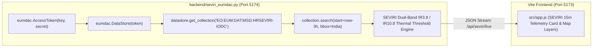

# EUMETSAT METEOSAT SEVIRI & ISRO INSAT GEOSTATIONARY INTEGRATION
## Rapid 15-Minute Cadence Pipeline for Real-Time Thermal Surge Alerting

---

## 1. Why Geostationary Satellites are Mandatory for Disaster Monitoring

Low Earth Orbit (LEO) satellites like VIIRS and MODIS offer superior spatial resolution ($375\text{ m}$), but they suffer from **orbital revisit gaps**:
* VIIRS passes over a given location in India only **twice every 24 hours** (e.g. ~01:30 AM and ~13:30 PM).
* If a catastrophic pipeline rupture, chemical explosion, or illegal night burn occurs at 04:00 AM, a pure LEO system will not detect it until 13:30 PM (a **9.5-hour life-threatening delay**).

**Geostationary satellites (GEO)** orbit at **35,786 km** in lockstep with Earth's rotation, remaining fixed over the exact same longitude 24 hours a day, 365 days a year.

---

## 2. Platform Architecture: EUMETSAT Meteosat MSG-IODC

EUMETSAT maintains the **Meteosat Second Generation (MSG) Indian Ocean Data Coverage (IODC)** mission specifically dedicated to monitoring the Indian subcontinent and western Indian Ocean:

| Parameter | Operational Specification |
| :--- | :--- |
| **Active Satellites** | Meteosat-9 (Primary) & Meteosat-11 (Backup) |
| **Orbital Position** | $45.5^\circ\text{E}$ Geostationary Orbit |
| **Payload Instrument** | Spinning Enhanced Visible and InfraRed Imager (SEVIRI) |
| **Observation Cadence** | **Every 15 minutes** (96 full-disk Earth scans per day) |
| **Spectral Channels** | 12 spectral bands (0.6 μm to 14.4 μm) |
| **Core Thermal Channels** | **Channel 4 (IR 3.9 μm MIR)** and **Channel 9 (IR 10.8 μm TIR)** |
| **Spatial Resolution** | 3.0 km at sub-satellite point (nadir); ~4.8 km to 6.5 km over Indian latitudes |

---

## 3. Official Python SDK Integration (`eumdac`)

AGNI-VISION interfaces with the official EUMETSAT Data Store using the European `eumdac` Python library (v3.1.1):

### 3.1. Python Client Implementation Details
Located in `backend/seviri_eumdac.py`:
1. Authenticates against EUMETSAT OAuth2 Gateway (`https://api.eumetsat.int/token`).
2. Queries the collection `EO:EUM:DAT:MSG:HRSEVIRI-IODC` (or the fallback Active Fire collection `EO:EUM:DAT:0801`).
3. Uses the sub-pixel dual-band brightness temperature difference:
   $$\Delta T = T_{\text{IR3.9}} - T_{\text{IR10.8}}$$
   When $\Delta T > 10.5\text{ K}$, a localized sub-pixel fire/flare is isolated even if the pixel covers a $4.8\text{ km}$ footprint.
4. Exposes a lightweight FastAPI/HTTP microservice on `http://localhost:5174` proxied seamlessly by Vite under `/api/seviri`.

---

## 4. ISRO INSAT-3D & INSAT-3DR Integration

India's domestic meteorological agency, ISRO (Indian Space Research Organisation), operates twin geostationary satellites:

| Parameter | INSAT-3D | INSAT-3DR |
| :--- | :--- | :--- |
| **Orbital Slot** | $82.0^\circ\text{E}$ GEO | $74.0^\circ\text{E}$ GEO |
| **Instrument** | 6-Channel Multi-Spectral Imager | 6-Channel Multi-Spectral Imager |
| **Key Fire Band** | MIR ($3.80 - 4.00\ \mu\text{m}$) at 4 km | MIR ($3.80 - 4.00\ \mu\text{m}$) at 4 km |
| **Temporal Cadence** | 30-minute repeat cycle | 30-minute repeat cycle |
| **Interleaved Cadence** | **Combined 15-minute staggered scan cycle over India** |
| **Key Advantage** | **Zero slant distortion**: Located directly overhead the Indian landmass ($74^\circ\text{E}-82^\circ\text{E}$), providing perfect perpendicular viewing angles. |

---

## 5. Multi-Cadence Handshake: How the Fusion Works

When an incident occurs in AGNI-VISION:

1. **Minute 0–15 (Instant Trigger):**
   - Meteosat SEVIRI or INSAT-3DR detects a sudden brightness temperature surge ($\Delta T > 12\text{ K}$) at a regional coordinate.
   - AGNI-VISION raises an **Amber Flare Surge Alert**.

2. **Sub-Daily Confirmation (High-Resolution Pinpointing):**
   - The system queries the latest VIIRS 375m and Nightfire (VNF) overpass.
   - It matches the coarse 4.8 km geostationary pixel to the exact **375-meter sub-pixel flare stack tip or field coordinate**.

3. **Ground Cross-Validation (Within Seconds):**
   - Live Open-Meteo weather is pulled for that exact coordinate (validating wind, rain, and humidity).
   - Ground OpenStreetMap boundaries are overlaid to identify the facility owner (e.g. CPCB registered refinery vs. unregistered brick kiln).
