# SATELLITE TELEMETRY, SENSORS & PHYSICAL FOUNDATIONS
## AGNI-VISION: Complete Multi-Constellation Remote Sensing Architecture

---

## 1. The Multi-Sensor Constellation Hierarchy

To solve the dual challenges of **orbital latency** and **spatial resolution**, AGNI-VISION combines multiple spaceborne platforms spanning geostationary, polar sun-synchronous, and atmospheric orbits:

```mermaid
graph TD
    subgraph Geostationary Orbit ["GEO (35,786 km) - 15-Minute Real-Time Scans"]
        SEVIRI["Meteosat-9/11 MSG-IODC (45.5°E) - SEVIRI (4.8 km)"]
        INSAT["ISRO INSAT-3D/3DR (74°E/82°E) - Imager (4.0 km)"]
    end
    subgraph Polar Low Earth Orbit ["LEO (700-830 km) - 375m Detection & High-Res"]
        VIIRS["NASA/NOAA VIIRS (Suomi-NPP, NOAA-20, NOAA-21) - 375m"]
        MODIS["NASA Terra & Aqua MODIS - 1 km"]
        VNF["VIIRS Nightfire (EOG / Payne Inst.) - Planck Dual-Band"]
        S2["ESA Copernicus Sentinel-2A/B - 10m/20m Multi-Spectral SWIR"]
    end
    subgraph Atmospheric Chemistry ["Tropospheric Orbit - Trace Gas Verification"]
        S5P["ESA Copernicus Sentinel-5P - TROPOMI Gas Column (3.5x5.5 km)"]
    end
    subgraph Surface & Weather ["Ground Validation & Meteorological Physics"]
        IMD["Open-Meteo & IMD Live Meteorological Feed"]
        CPCB["CPCB CAAQMS Real-Time Air Quality Network"]
    end

    SEVIRI -->|15-min Rapid Fire Surge Alert| ENGINE[AGNI-VISION Fusion & Cross-Validation Engine]
    INSAT -->|Zero-Slant Sub-Continent Nadir| ENGINE
    VIIRS -->|Real-Time Hotspot Coordinates & FRP| ENGINE
    VNF -->|Combustion Temperature Kelvin| ENGINE
    S5P -->|CO, NO2, SO2, UVAI Gas Fingerprint| ENGINE
    S2 -->|Post-Overpass ΔNBR Burn Scar Forensic Proof| ENGINE
    IMD -->|Live Coordinates Temp, Humidity, Rain & Wind| ENGINE
    CPCB -->|Downwind Ground Ambient Particulate Verification| ENGINE
```

---

## 2. Sensor Technical Specification Matrix

| Platform / Satellite | Operator / Agency | Orbital Mechanics | Sensor Instrument | Core Channels / Bands | Spatial Resolution | Temporal Revisit Frequency | Detection Role in AGNI-VISION |
| :--- | :--- | :--- | :--- | :--- | :--- | :--- | :--- |
| **Suomi-NPP** | NASA / NOAA | Polar Sun-Synch (824 km) | VIIRS | I-4 (3.74 μm MIR), I-5 (11.45 μm TIR) | **375 m** | 2 times / day (~01:30 & 13:30 local) | Primary Live Hotspot Detection & Radiative Power (FRP) |
| **NOAA-20 (JPSS-1)** | NASA / NOAA | Polar Sun-Synch (824 km) | VIIRS | I-4 (3.74 μm MIR), I-5 (11.45 μm TIR) | **375 m** | 2 times / day (50 min offset from NPP) | Real-Time Corroboration & Interleaved Detection |
| **NOAA-21 (JPSS-2)** | NASA / NOAA | Polar Sun-Synch (824 km) | VIIRS | I-4 (3.74 μm MIR), I-5 (11.45 μm TIR) | **375 m** | 2 times / day | Constellation Interleaving |
| **Terra / Aqua** | NASA EOS | Polar Sun-Synch (705 km) | MODIS | Channel 21/22 (3.9 μm), Channel 31 (11.0 μm) | **1 km** | 2 times / day | Legacy Baseline Corroboration |
| **Meteosat MSG-IODC** | EUMETSAT | Geostationary (35,786 km @ 45.5°E) | SEVIRI | Band 4 (MIR 3.92 μm), Band 9 (TIR 10.8 μm) | **3.0 km (nadir), ~4.8 km over India** | **Every 15 minutes (96 scans/day)** | **Instant Rapid Surge Alarm**: Detects refinery flare blowouts within 15 min |
| **INSAT-3D / INSAT-3DR** | ISRO | Geostationary (35,786 km @ 74°E & 82°E) | Imager (6-Ch) | MIR (3.80–4.00 μm), TIR-1 (10.2–11.2 μm) | **4.0 km (zero slant over India)** | **Every 15 minutes** (interleaved between 3D & 3DR) | Domestic Geostationary Surveillance over Indian Landmass |
| **Sentinel-5P** | ESA Copernicus | Polar Sun-Synch (824 km) | TROPOMI | UV (310-330nm), VIS (405-465nm), SWIR (2.3μm) | **3.5 km × 5.5 km** | **Every 24 hours (Daily)** | **Combustion Chemistry**: Measures CO, NO₂, SO₂, and UV Aerosol Index (UVAI) |
| **Sentinel-2A / 2B** | ESA Copernicus | Polar Sun-Synch (786 km) | MSI (13 Bands) | B4 (Red 665nm), B8A (Narrow NIR 865nm), B12 (SWIR 2190nm) | **10 m – 20 m** | **Every 5 days** (twin constellation) | **Forensic Burn Proof**: Calculates ΔNBR and high-res imagery for statutory CPCB prosecution |

---

## 3. Atmospheric Combustion Chemistry via Sentinel-5P TROPOMI

Copernicus Sentinel-5P carries the **TROPOMI (TROPOspheric Monitoring Instrument)** spectrometer. In AGNI-VISION, Sentinel-5P is utilized to distinguish between **biomass combustion**, **fossil fuel refining**, and **false alarms**:

### 3.1. Chemical Signatures & Physical Rationale

1. **Carbon Monoxide ($CO$) — Band 7 (SWIR 2305–2385 nm)**
   - **Physics**: Produced by incomplete combustion of organic matter where oxygen supply is limited.
   - **Biomass Fires**: Emit massive spikes ($> 2.5 \times 10^{-2}\text{ mol/m}^2$).
   - **Industrial Stacks**: Modern flare tips have forced steam/air assist, converting most carbon to $CO_2$. A high $CO$ reading indicates inefficient burning or open ground stubble.

2. **Tropospheric Nitrogen Dioxide ($NO_2$) — Band 4 (VIS 405–465 nm)**
   - **Physics**: Formed at extreme combustion temperatures ($> 1,000^\circ\text{C}$) via thermal fixation of atmospheric nitrogen (Zeldovich mechanism).
   - **Application**: Directly indexes the **flaming front intensity** versus low-temperature smoldering.

3. **Sulfur Dioxide ($SO_2$) — Band 3 (UV 310–330 nm) [The Industrial Discriminator]**
   - **Biomass / Crop Stubble Burning**: Contains almost zero sulfur ($\text{SO}_2 < 5\ \mu\text{mol/m}^2$).
   - **Coal-Fired Power Plants & Unregistered Brick Kilns**: Burn low-grade coal or petcoke, producing massive $SO_2$ plumes ($> 25\ \mu\text{mol/m}^2$).
   - **Diagnostic Rule**: If a thermal hotspot exhibits elevated $SO_2$, AGNI-VISION flags it as an **industrial fossil fuel source**, rejecting false reports of forest or agricultural fires.

4. **UV Aerosol Index (UVAI) — Band 3 (340 nm / 380 nm Ratio)**
   - **Physics**: Detects the wavelength-dependent absorption of UV radiation by airborne black carbon (soot), ash, and brown carbon.
   - **Thresholds**:
     - $\text{UVAI} < +1.0$: Clean background atmosphere.
     - $+1.0 \le \text{UVAI} < +2.0$: Moderate absorbing smoke aerosols.
     - $\text{UVAI} \ge +2.0$: Dense, thick combustion smoke plume aloft.

---

## 4. Optical Forensic Burn Validation via Copernicus Sentinel-2

### 4.1. The 5-Day Revisit Reality & Forensic Usage
* **Why Sentinel-2 is NOT an instantaneous alarm**: Sentinel-2's 290 km swath width results in a 5-day revisit over India. It only acquires imagery during its ~10:30 AM morning descending node and cannot see through night darkness.
* **Operational Usage**: While VIIRS and INSAT provide real-time alerts ($T=0$), Sentinel-2 provides the **statutory legal proof** ($T=+1\text{ to }+5\text{ days}$) required by the National Green Tribunal (NGT) and CPCB.

### 4.2. Normalized Burn Ratio (NBR) Formulation
Sentinel-2 measures Near-Infrared (Band 8A, 865 nm, sensitive to living chlorophyll) and Short-Wave Infrared (Band 12, 2190 nm, sensitive to charred soil and active flame reflection):

$$\text{NBR} = \frac{\rho_{B8A} - \rho_{B12}}{\rho_{B8A} + \rho_{B12}}$$

The differential burn severity index ($\Delta\text{NBR}$) compares the post-incident overpass against pre-fire historical baseline:

$$\Delta\text{NBR} = \text{NBR}_{\text{pre}} - \text{NBR}_{\text{post}}$$

* $\Delta\text{NBR} < -0.40$: High-severity burn scar (complete canopy/stubble incineration).
* $-0.40 \le \Delta\text{NBR} < -0.25$: Moderate-severity burn / localized charring.
* $-0.10 \le \Delta\text{NBR} \le +0.10$: Unburned ground / false thermal alarm (e.g. temporary solar reflection).

---

## 5. Live Meteorological Integration (IMD / Open-Meteo) & Thermal Plausibility

For every hotspot clicked in the platform, AGNI-VISION queries the live meteorological stream for that exact coordinate:

$$\text{Endpoint: } \text{https://api.open-meteo.com/v1/forecast?latitude=LAT&longitude=LON\&current=temperature\_2m,relative\_humidity\_2m,precipitation,wind\_speed\_10m,wind\_direction\_10m}$$

### 5.1. Dynamic Thermal Plausibility Index
The system calculates whether atmospheric and soil moisture conditions permit sustained open combustion:

$$\text{Plausibility (\%)} = \min\Big(\max\big(100 - (0.45 \times \text{RH}) + (0.75 \times T_{\text{amb}}) + (0.20 \times \text{FRP}),\ 55\big),\ 99\Big)$$

* Where $T_{\text{amb}}$ is 2-meter air temperature (°C), $\text{RH}$ is relative humidity (%), and $\text{FRP}$ is Fire Radiative Power (MW).
* **Rain Invalidation**: If live precipitation is $> 0.5\text{ mm}$, the plausibility index drops significantly, flagging that any thermal alert is likely an enclosed chimney or false specular reflection.

### 5.2. Real-Time Downwind Gaussian Dispersion Sync
The live meteorological wind vector automatically updates the map's downwind hazard cone:
* Wind direction ($^\circ$) sets the central axis $\theta$ of the dispersion cone.
* Wind speed ($\text{km/h}$) expands the hazard boundary length downwind ($L = v \times t$).
